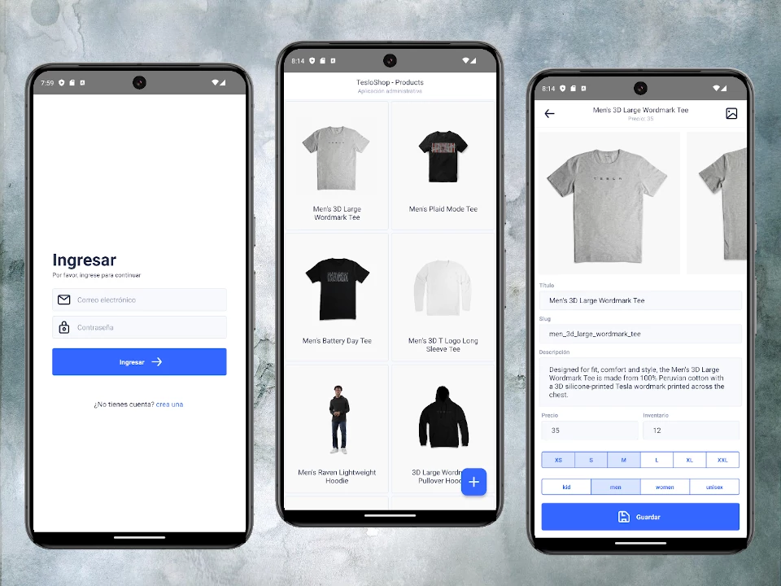

# Proyecto : App Tesloshop

# Nest - Backend

## Development
1. Tener corriendo el servicio de Docker (Docker Desktop o Docker Daemon)
2. Clonamos el repositorio: https://github.com/Klerith/tesloshop-backend
3. Clonar el archivo __.env.template__ y renombrar la copia a __.env__
4. Levantar los servicios con el comando
```
docker compose up -d
```
5. Llenar la base de datos con data temporal:

    http://localhost:3000/api/seed

6. Documentación de los endpoints disponibles:

    http://localhost:3000/api

# React Native - App

## Paso 1: Variables de entorno

Clonar el archivo __.env.template__ y renombrar la copia a __.env__ y cambiar los datos de acuerdo a la configuración del backend, algunas configuraciones requieren su dirección IP local.

## Paso 2: Inicie el servidor Metro

Para iniciar Metro, ejecute el siguiente comando desde el directorio _raíz_ de la aplicación:

```bash
# using npm
npm start

# OR using Yarn
yarn start
```

## Paso 3: Inicie la aplicación

Deje que Metro Bundler se ejecute en su propia terminal. Abra una _nueva_ terminal desde la _raíz_. Ejecute el siguiente comando para iniciar su aplicación _Android_ o _iOS_:

### Para Android

```bash
# using npm
npm run android

# OR using Yarn
yarn android
```

### Para iOS

```bash
# using npm
npm run ios

# OR using Yarn
yarn ios
```
